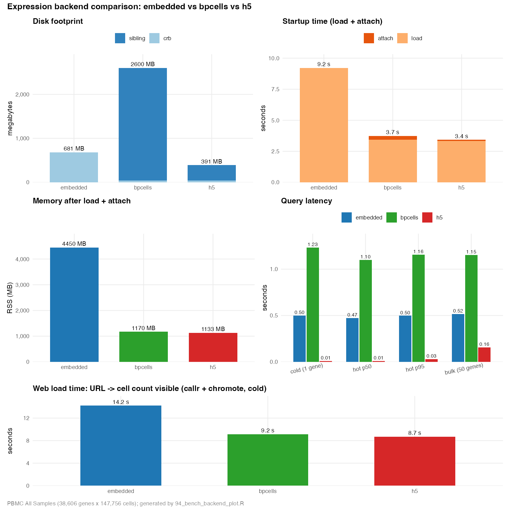

```{r, include = FALSE}
knitr::opts_chunk$set(
  collapse = TRUE,
  comment = "#>",
  eval = FALSE
)
```

# Overview

`exportFromSeurat()` and `convertSeuratToCerebro()` can persist the expression matrix in one of three modes via `expression_matrix_mode`: `"embedded"` (default — matrix lives inside the `.crb`), `"bpcells"` (BPCells on-disk matrix in a sibling `<stem>.bpcells/` directory), or `"h5"` (sparse CSC HDF5 in a sibling `<stem>.h5` file, written via `HDF5Array::writeTENxMatrix()` since 1.7.0). The same crb can therefore expand into very different on-disk footprints, startup costs, and runtime memory profiles, and the right choice depends on what you optimise for.

This vignette walks through a controlled comparison of all three on a single fixture, summarises the trade-offs, and points at the underlying scripts so the experiment can be reproduced once the source data is available.

# The three backends

All three store the same matrix; what differs is **where** it lives, **when** it gets read, and what's left on disk and in RAM. The right pick depends on what you optimise for.

**Eager vs lazy in one paragraph.** *Eager* = "read the whole matrix into RAM up front, then index it from there" — the `embedded` and (1.6.0) h5 paths. *Lazy* = "keep the matrix on disk, only read the slice the caller asked for" — the `bpcells` and (1.7.0) h5 paths. Cerebro's typical query is "give me one gene across all cells", which touches < 0.003 % of the matrix — so paying ~10 GB of RAM and ~20 s of attach time to read everything eagerly is mostly wasted work. Lazy backends keep the OS page cache hot for recently-read columns, so repeat queries are essentially memory-speed without ever committing the whole matrix to the R process's RAM. The `crb$expression <- NULL` step in the exporter is what makes this work: leave the in-memory `dgCMatrix` attached and `saveRDS` would re-embed it inside the `.crb`, defeating the whole point of the sibling.

| dimension | `embedded` | `bpcells` | `h5` |
|---|---|---|---|
| **Where the matrix lives** | inside the `.crb` itself, serialised with `saveRDS` | sibling `<stem>.bpcells/` directory (BPCells's own packed format) | sibling `<stem>.h5` file (10X TENx CSC layout, written by `HDF5Array::writeTENxMatrix()`) |
| **What the `.crb` contains** | metadata + projections + trees + **the full matrix** | metadata + projections + trees + a lightweight `IterableMatrix` handle (just an absolute path string) | metadata + projections + trees + a backend tag (`type = "h5"`, `location = "<stem>.h5"`) |
| **`.crb` size on this fixture** | 681 MB | 43 MB | 42 MB |
| **Attach behaviour** | nothing to do; matrix is already in memory after `readRDS` | `open_matrix_dir()` opens file handles on the sibling dir — no data read yet | `TENxMatrix(file, group)` reads only top-level dimnames; the `data`/`indices`/`indptr` arrays stay on disk |
| **Runtime data access** | direct `dgCMatrix` indexing (in RAM) | streams chunks from disk through BPCells's packed format (chunk-level batched reads) | streams individual TENx columns from disk through `HDF5Array`'s page cache (column = single gene; OS caches recently-read columns automatically) |
| **Best for** | small datasets, single-file portability, RAM is plentiful | RAM-constrained host with very large matrices, batched/chunked workloads | most deployments — smallest disk, fastest startup, lowest RAM, fastest per-gene queries thanks to the column-favoured TENx layout |
| **Extra package needed** | none | `BPCells` (GitHub) | `HDF5Array` (Bioconductor; pulls `rhdf5` transitively) |
| **Portability** | single `.crb` file; works with any reader | `.crb` + `<stem>.bpcells/` must travel together | `.crb` + `<stem>.h5` must travel together; the `.h5` is readable by any TENx-compatible tool (e.g. 10X CellRanger downstream tools) |

The two external backends (`bpcells`, `h5`) are both lazy — the in-memory `dgCMatrix` is never materialised on attach. The 1.7.0 lazy h5 attach reuses Roman Hillje's original `HDF5Array::TENxMatrix` seed pattern from [`create_expression_matrix_in_h5_format.Rmd`](create_expression_matrix_in_h5_format.html); prior to 1.7.0 the h5 attach was eager and recreated a full `dgCMatrix` from raw rhdf5 reads at attach time (see the appendix at the end of this vignette for the before/after numbers).

# Data

The benchmark target is an internal Seurat integration of a PBMC TCR/BCR study (STACAS-integrated, ~5.9 GB on disk in `.qs` form). The fixture itself is not redistributable, so it lives outside the package and is read by the conversion scripts in `tests/smoke/`. Key dimensions after conversion:

| field | value |
|---|---|
| genes | 38,606 |
| cells | 147,756 |
| assay | `RNA` |
| slot | `counts` |
| organism | Human PBMC |
| groups | `celltype_merged.l1`, `timepoint`, `sample` |
| sparsity | high (typical scRNA-seq counts) |

The dataset is intentionally large enough that the three backends pull apart on every axis we measure. Smaller fixtures (e.g. `inst/extdata/v1.4/example.crb`) compress the differences too aggressively to be informative.

# What the benchmark measures

For each backend the script measures:

| metric | what it captures |
|---|---|
| `disk_crb_mb` | size of the `.crb` itself |
| `disk_sibling_mb` | size of the external sibling (NA for `embedded`) |
| `load_secs` | `readRDS()` of the `.crb` file — pure deserialisation of the metadata/projections/etc. plus, for `embedded`, the expression matrix itself |
| `attach_secs` | `.attachExternalExpression()` — for `embedded` it just validates the backend tag and returns; for `bpcells` it opens a lazy `IterableMatrix` handle on the sibling directory; for `h5` it opens a lazy `HDF5Array::TENxMatrix` seed and applies a free `DelayedArray::t()` to expose Cerebro's genes × cells layout (no data is read at attach time) |
| `rss_mb` | process resident-set size after load + attach |
| `cold_secs` | first single-gene full-row read after attach |
| `hot_p50_secs` / `hot_p95_secs` | 30 single-gene reads rotating through a 50-gene pool |
| `bulk_secs` | densified 50-gene × all-cells slice (the `marker_genes` tab pattern) |

Each backend runs in a **fresh R subprocess** via `callr::r()`, so the RSS reading for one backend is not polluted by the matrix left over from the previous backend. Reads go through the class accessors `getExpressionRow()` / `getExpressionBlock()` — the same code path the Shiny server uses — so the comparison reflects realistic runtime cost rather than raw `dgCMatrix` indexing.

# Running it locally

Both scripts live under `tests/smoke/src/` and read fixtures from `tests/smoke/data/` (paths relative to `tests/smoke/`). Run the converters first (each writes into its own `tests/smoke/result/...` subdirectory), then the bench, then the plot helper:

```{r}
# from tests/smoke/
Rscript src/10_convert_embedded.R
Rscript src/11_convert_bpcells.R
Rscript src/12_convert_h5.R
Rscript src/93_bench_backend_compare.R   # server-side bench
Rscript src/94_bench_web_load.R          # web load bench (callr + chromote)
Rscript src/95_bench_backend_plot.R      # combined 5-panel plot
```

The bench produces `result/93_bench_backend_compare/{summary.csv, run.log}` (server side) and `result/93_bench_backend_compare/{web_load.csv, web_load.log}` (web side). The plot helper consumes both CSVs and writes `summary.png` and `summary.pdf` to the same directory.

# Results

Numbers below were captured on PBMC All Samples (38,606 genes × 147,756 cells), each backend in its own fresh R subprocess via `callr::r()`. Smaller is better in every column. The h5 column reflects the 1.7.0 lazy `HDF5Array::TENxMatrix` attach; the prior 1.6.0 eager attach numbers are kept in a footnote at the bottom of the section for context.

| metric | embedded | bpcells | h5 |
|---|---:|---:|---:|
| disk_crb_mb | 681 | 43 | **42** |
| disk_sibling_mb | — | 2,557 | 349 |
| **disk_total_mb** | 681 | 2,600 | **391** |
| load_secs | 9.20 | 3.43 | **3.34** |
| attach_secs | 0.015 | 0.305 | **0.087** |
| **startup_total_secs** | 9.22 | 3.74 | **3.43** |
| **rss_mb** | 4,450 | 1,170 | **1,133** |
| cold_secs | 0.501 | 1.234 | **0.010** |
| hot_p50_secs | 0.473 | 1.099 | **0.009** |
| hot_p95_secs | 0.498 | 1.155 | **0.031** |
| bulk_secs (50 × ncells) | 0.515 | 1.154 | **0.157** |

The same data, plotted (five panels on a single page — disk, startup, memory, latency, web load):

{width=100%}

The 1.7.0 numbers are the canonical reference for everything below. The equivalent 1.6.0 eager-attach numbers and the full before/after diff live in the [Appendix](#appendix-1-6-0-eager-h5-baseline) at the end of this vignette.

# Web load time (what the user actually sees)

The numbers above are server-side and only count R-level work. The number that matters in practice is what a user perceives in the browser: from the moment they open the app URL to the moment the dataset is actually usable on screen.

The script `tests/smoke/src/94_bench_web_load.R` measures this end-to-end. For each backend it generates a single-dataset Shiny app via `createShinyApp()`, spawns it under `callr::r_bg()`, opens a fresh `chromote::ChromoteSession`, navigates to the URL, and polls the DOM for the text "147,756" (the dataset's cell count, rendered by Shiny only after `data_set` reactive has loaded the `.crb` and called `getNumberOfCells()`). The wall-clock from `t0 = before chromote navigates` to `t1 = cell count appears` is the user-perceived "open URL → dataset visible" metric. Each backend uses its own R subprocess + Chrome session so caches do not bleed across.

| | embedded | bpcells | h5 |
|---|---:|---:|---:|
| TTFB (ms) | 44 | 39 | 39 |
| DOM ready (ms) | 86 | 74 | 70 |
| `load` event (ms) | 124 | 105 | 91 |
| **cell count visible (ms)** | **14,218** | **9,151** | **8,704** |

The TTFB / DOM-ready / `load` numbers are essentially identical across backends because they only depend on serving the static HTML + JS bundle. All the divergence shows up in the last row, where the Shiny session has to establish, the R server has to load the `.crb`, attach the external sibling if any, and emit the first reactive outputs.

The web ranking matches the bench:

- **h5 (~8.7 s)** and **bpcells (~9.2 s)** — basically tied at the top. Both are lazy on attach (h5 via `TENxMatrix` seed, bpcells via `IterableMatrix` handle) so the user sees the dataset ready as soon as Shiny has spoken to the server once.
- **embedded (~14.2 s)** — pays its ~9 s `readRDS` to deserialise the in-`.crb` matrix, plus the same Shiny session handshake.

So if you actually deploy this somewhere, **h5 and bpcells give the fastest "open URL → usable" experience**, with embedded a few seconds behind. The browser does almost no work — the gap is entirely server-side, exactly as the bench predicted.

For comparison, 1.6.0 eager h5 sat at ~33 s on this metric — see the [Appendix](#appendix-1-6-0-eager-h5-baseline) for the full before/after table.

# Interpretation

**Disk** — `h5` wins on total disk (391 MB) because the TENx CSC layout compresses well inside HDF5; `bpcells` writes the largest payload (2.6 GB) because its packed format stores extra index structure per chunk. `embedded` sits in the middle (681 MB). The `.crb` itself is tiny (~42 MB) for both external backends because it carries only metadata, projections, and trees plus a backend pointer — no expression matrix.

**Startup** — the total here is `load_secs + attach_secs`, and the three backends are now much closer together than in 1.6.0:

- `embedded` spends almost all of its budget in `load_secs` (~9 s) because the matrix is *inside* the `.crb` and `readRDS()` has to deserialise the whole thing. `attach` is effectively free (0.015 s) — there is nothing external to attach, the helper just confirms the backend tag.
- `bpcells` has a small `load_secs` (~3 s, the `.crb` is only metadata) and a small `attach_secs` (~0.3 s). `open_matrix_dir()` only opens file handles on the sibling directory; no expression data is read until a query needs it.
- `h5` has the same small `load_secs` as `bpcells`, and `attach_secs` is now also tiny (~0.087 s) because `HDF5Array::TENxMatrix(file, group)` only reads the top-level dimensions and dimnames; the actual `data`/`indices`/`indptr` arrays stay on disk and are read lazily at query time.

Net effect: `h5` wins startup overall (~3.4 s), `bpcells` is essentially tied (~3.7 s), `embedded` is in the middle (~9.2 s).

**Memory** — `h5` and `bpcells` both run in ~1.1-1.2 GB RSS because neither materialises the full matrix; `h5` queries stream individual columns through `HDF5Array`'s page cache, `bpcells` queries stream chunks through its packed format. `embedded` keeps the full sparse matrix in memory (~4.5 GB on this fixture).

**Query latency** — `h5` is now dramatically faster than the other two on single-gene reads (~0.01 s, vs ~0.5 s for embedded and ~1.1 s for bpcells). Two effects compound here: (1) TENx CSC stores cells as rows and genes as columns, so a single-gene read is a contiguous CSC column slice, the cheapest possible HDF5 access pattern, and (2) the kernel page cache holds the relevant column blocks in RAM after the first read, so "hot" reads are basically memory-speed without paying the dgCMatrix indexing overhead embedded incurs. `bpcells` is slowest on single-gene reads because its row-oriented packed format has to densify chunks; the gap closes on bulk slices (50 genes × all cells) but `h5` still wins (~3-7× faster).

# When to pick what

- **`h5`** *(recommended default for most deployments)* — smallest disk, fastest startup, lowest RAM, fastest queries. The TENx CSC layout aligns with how Cerebro reads expression (per-gene), and HDF5 page-caching makes repeated reads memory-fast without committing the whole matrix to RAM. Cost: requires the `HDF5Array` Bioconductor package on the host. Works for any size from small to million-cell datasets.
- **`bpcells`** — RAM-constrained host, very large matrices, or when you want BPCells's chunk-level optimisations (e.g. for batched all-cell operations rather than per-gene reads). Single-gene query is ~1 s, so feel out the workload before defaulting here.
- **`embedded`** — single-file convenience (no sibling to manage), or compatibility with very old `.crb` readers. Loads in ~9 s and pins the full matrix (~4.5 GB on this fixture) into RAM per loaded copy. Best for small datasets or one-shot scripts that load and discard.

# Reproducing on your own data

`tests/smoke/src/93_bench_backend_compare.R` is parameter-free — it reads the three PBMC `.crb` files produced by scripts 10/11/12. To bench a different dataset, copy the script, swap the three `crb` / `sibling` paths in the `backends` list at the top, and rerun. The script gracefully skips backends whose `.crb` is missing, so partial setups (e.g. only embedded and h5) work too.

```{r}
backends <- list(
  embedded = list(
    crb     = "result/10_convert_embedded/cerebro_my_dataset.crb",
    sibling = NULL
  ),
  bpcells = list(
    crb     = "result/11_convert_bpcells/cerebro_my_dataset.crb",
    sibling = "result/11_convert_bpcells/cerebro_my_dataset.bpcells"
  ),
  h5 = list(
    crb     = "result/12_convert_h5/cerebro_my_dataset.crb",
    sibling = "result/12_convert_h5/cerebro_my_dataset.h5"
  )
)
```

# Reference

- `tests/smoke/src/93_bench_backend_compare.R` — server-side bench (callr-isolated, writes `summary.csv`)
- `tests/smoke/src/94_bench_web_load.R` — web load bench (callr-spawned Shiny + chromote-driven Chrome, writes `web_load.csv`)
- `tests/smoke/src/95_bench_backend_plot.R` — 5-panel plot helper (consumes both CSVs, writes `summary.png` / `summary.pdf`)
- `tests/smoke/src/{10,11,12}_convert_*.R` — converters per backend
- `?exportFromSeurat`, `?convertSeuratToCerebro` — backend selection via `expression_matrix_mode`

# Appendix: 1.6.0 eager h5 baseline

Before the 1.7.0 refactor the h5 attach was eager: `.attachExternalExpression()` called `rhdf5::h5read()` on all six datasets under `/expression/` and rebuilt a full `dgCMatrix` in RAM, mirroring the eager dgCMatrix path that `embedded` already uses. The disk format itself was a self-rolled CSC layout (`/expression/{data,indices,indptr,shape,genes,barcodes}`) written via `rhdf5::h5write()`, not TENx — but the field names and on-disk shape happened to match TENx closely enough that `HDF5Array::TENxMatrix()` could read them after the fact.

The 1.7.0 refactor changed two files:

- `R/exportFromSeurat.R` — exporter now writes via `HDF5Array::writeTENxMatrix()` (canonical TENx schema, future-proof).
- `inst/shiny/v1.4/utility_functions.R` — attach now opens a lazy `HDF5Array::TENxMatrix` seed and lazily `t()`s it back to genes × cells (no data read at attach time; the in-memory `dgCMatrix` is never materialised).

The `Cerebro_v1.3` accessors `getExpressionRow()` / `getExpressionBlock()` already had a `DelayedMatrix` code path, so no downstream changes were needed in the class or the Shiny modules.

Same fixture, same scripts, same hardware — only the h5 attach implementation changed:

| metric | h5 (1.6.0 eager) | h5 (1.7.0 lazy) | improvement |
| --- | ---: | ---: | ---: |
| `attach_secs`                  | 22.9   | **0.087** | ~263× faster |
| `rss_mb` after attach          | 11,210 | **1,133** | ~10× smaller |
| `cold_secs` (single gene)      | 0.45   | **0.010** | ~45× faster |
| `hot_p50_secs`                 | 0.46   | **0.009** | ~51× faster |
| `bulk_secs` (50 × ncells)      | 0.51   | **0.157** | ~3× faster |
| open URL → dataset visible     | 33.0 s | **8.7 s** | ~4× faster |
| `disk_total_mb`                | 354    | 391       | +10% (TENx adds a small metadata overhead) |

The `.crb` size (~42 MB) and `load_secs` (~3.3 s) are unchanged — only the attach path and everything downstream of it improved.

The 1.6.0 row above came from running `93_bench_backend_compare.R` against commit `b8cdadc`. To reproduce, `git checkout b8cdadc -- R/exportFromSeurat.R inst/shiny/v1.4/utility_functions.R`, regenerate the h5 sibling (with `12_convert_h5.R` or the inline mini-script in [`tests/smoke/README.md`](../tests/smoke/README.md)), and rerun the bench.
