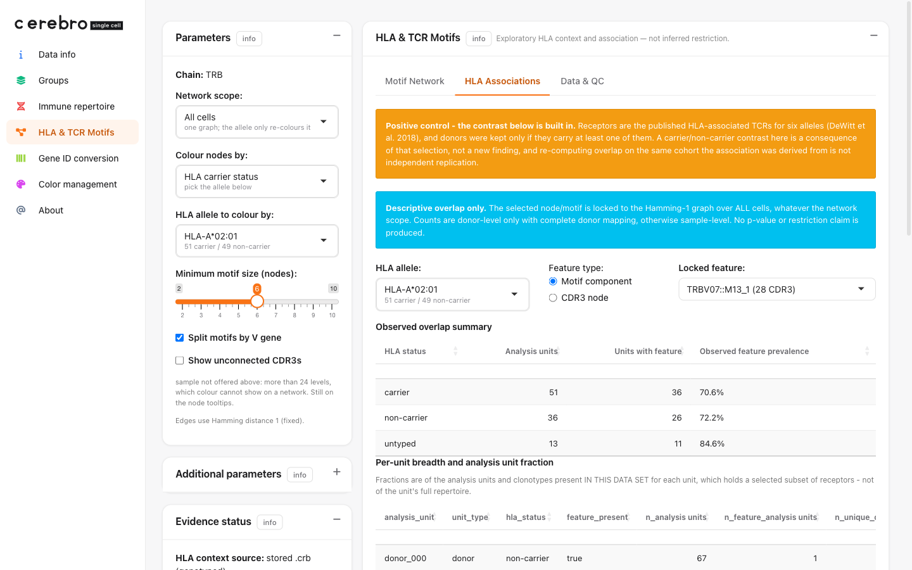

```{r, include = FALSE}
knitr::opts_chunk$set(collapse = TRUE, comment = "#>")
```

# What this guide does

The main HLA guide builds a *single-cell* data set.
This companion covers the other input the **HLA Associations** tab is made for: **bulk TCRβ immunosequencing paired with real donor HLA genotypes**.

If you have not read the main guide, skim its "two ideas" section first — this one assumes you know what a CDR3, a motif, and an HLA allele are.
As before, every code block runs on its own (base R + `Matrix` + `cerebroAppLite`, no downloads), and we print each object as we build it.

## How bulk data is different

Bulk immunosequencing does not sequence single cells; it sequences *receptors* out of a pool.
That changes three things, and the `.crb` states each one openly rather than letting the app guess:

- **There are no cells.**
  Each row is a *(donor, receptor clonotype)* **analysis unit**.
  The data set carries a real **0-gene** expression matrix (bulk measures no transcriptome) and no projection, so the Projection and Gene expression tabs simply have nothing to draw.
- **There is no lineage.**
  Bulk TCRβ cannot tell a CD4 cell from a CD8 cell, so the MHC-class context is *Unknown by design* — the page must not invent one.
- **Counting is per donor.**
  One donor is one sample, and we write `donor_id` explicitly, so carrier counts are donor-level.

The payoff: the HLA genotypes are **real**, so the Associations tab runs on genuine biology instead of an invented genotype.

<div style="border-left: 4px solid #e69500; background: #fff6e6; padding: 0.6em 1em; margin: 1em 0;">
**"Association-conditioned" means positive control, not evidence.**
The public demo's receptors were chosen *using* a published HLA association, and donors were then kept only if they carry one of those receptors.
So any carrier / non-carrier difference you see was **built in by that selection**, and re-checking it on the very cohort the association came from is not independent replication.
Treat it as a positive control that proves the workflow runs — nothing more.
The `.crb` says so (`technical_info$tcr_selection = "association-conditioned"`) and the app shows an orange warning wherever the contrast appears.
</div>

# The workflow in miniature

Bulk data has no Seurat object, so you assemble the Cerebro object by hand.
The essence is short: **declare the contracts, store a 0-gene matrix, then add the receptors and the real HLA**.

```{r, eval = FALSE}
# ... build `meta` (one row per analysis unit), `ir` (receptors), `hla_long` (genotypes)

crb <- Cerebro_v1.3$new()
crb$technical_info <- list(observation_unit = "analysis unit",   # a row is NOT a cell
                           receptor_key     = "v_gene+cdr3",
                           tcr_selection    = "association-conditioned")
crb$expression <- Matrix::Matrix(0, nrow = 0, ncol = nrow(meta), sparse = TRUE)  # no transcriptome
crb$meta_data  <- meta
crb$addImmuneRepertoire(ir)                                # real receptors
crb$addHLATyping(hla_long, source_type = "genotyped")      # real genotypes
saveRDS(crb, "demo_hla_tcr_bulk_toy.crb")

launchCerebro(crb_file_to_load = "demo_hla_tcr_bulk_toy.crb")
```

The rest of this guide fills in `meta`, `ir`, and `hla_long`, and shows each one.

# Two ways to get bulk data into a `.crb`

## Option A — the real public cohort (pubtcrs / Emerson 2017)

The shipped `demo_hla_tcr_bulk.crb` is built from real data: the Emerson et al. (*Nat Genet* 2017) cohort as cleaned by DeWitt et al. (*eLife* 2018), distributed as `pubtcrs_data_v1.tgz` on Zenodo record [1248193](https://zenodo.org/records/1248193).
It holds 630 donors' real HLA typing, roughly 11 million public TCRβ chains, and the paper's own table of HLA-associated receptors.
The build script downloads and assembles all of it:

```{r, eval = FALSE}
# ~349 MB download; see data-raw/build_hla_tcr_bulk_demo.R for the full pipeline
mkdir -p data-raw/pubtcrs
curl -fL -o data-raw/pubtcrs/pubtcrs_data_v1.tgz \
  "https://zenodo.org/api/records/1248193/files/pubtcrs_data_v1.tgz/content"
tar xzf data-raw/pubtcrs/pubtcrs_data_v1.tgz -C data-raw/pubtcrs
# then: Rscript data-raw/build_hla_tcr_bulk_demo.R
```

That needs a large download, so the rest of this guide uses a small **synthetic** stand-in that produces a structurally identical `.crb` you can run right now.
The provenance differs (synthetic vs. real), but the object layout, the contracts, and the Associations tab behave the same.

## Option B — a small synthetic bulk `.crb` you can run now

There is no Seurat object here (no cells), so we build the `Cerebro_v1.3` object **by hand**.

### Setup and donors

```{r, eval = FALSE}
library(Matrix)
library(cerebroAppLite)

set.seed(7)
donors <- sprintf("donor_%03d", 1:30)
AA <- strsplit("ACDEFGHIKLMNPQRSTVWY", "")[[1]]
rand_cdr3 <- function() paste0("CASS", paste(sample(AA, sample(6:11, 1), TRUE), collapse = ""), "F")
```

### Real-shaped HLA typing (the canonical long table)

For bulk we write the **canonical long table** directly — one row per donor × gene × copy — so `donor_id` is explicit and counting stays at the donor level.
The first fifteen donors carry the anchor `HLA-A*02:01`.

```{r, eval = FALSE}
a02_carriers <- donors[1:15]
hla_long <- do.call(rbind, lapply(donors, function(d) {
  a1 <- if (d %in% a02_carriers) "A*02:01" else sample(c("A*01:01", "A*03:01", "A*11:01"), 1)
  a2 <- sample(c("A*01:01", "A*03:01", "A*24:02", "A*11:01"), 1)
  data.frame(
    sample = d, donor_id = d,
    locus = c("HLA-A", "HLA-A", "HLA-B", "HLA-B"),
    copy  = c(1L, 2L, 1L, 2L),
    allele = c(a1, a2, sample(c("B*07:02", "B*08:01"), 1), sample(c("B*44:02", "B*35:01"), 1)),
    stringsAsFactors = FALSE
  )
}))
```

**Look at what you built** — four rows per donor (two `HLA-A` copies, two `HLA-B`):

```{r, eval = FALSE}
head(hla_long, 6)
```
```
#>     sample  donor_id locus copy  allele
#>  donor_001 donor_001 HLA-A    1 A*02:01
#>  donor_001 donor_001 HLA-A    2 A*03:01
#>  donor_001 donor_001 HLA-B    1 B*07:02
#>  donor_001 donor_001 HLA-B    2 B*44:02
#>  donor_002 donor_002 HLA-A    1 A*02:01
#>  donor_002 donor_002 HLA-A    2 A*11:01
```

### Clonotypes: association-conditioned receptors over a background

Six "public" receptors are placed in most carriers and almost no non-carrier — the designed-in contrast the positive-control warning is about.
Everyone also gets a handful of private background clonotypes.

```{r, eval = FALSE}
assoc_tcrs <- replicate(6, list(v = paste0("TRBV", sample(2:29, 1)), cdr3 = rand_cdr3()), simplify = FALSE)

ir <- list(); meta_rows <- list()
for (d in donors) {
  clones <- replicate(sample(8:15, 1),
                      list(v = paste0("TRBV", sample(2:29, 1)), cdr3 = rand_cdr3()),
                      simplify = FALSE)
  for (a in assoc_tcrs) {                       # associated receptors: ~85% of carriers, ~8% of others
    p <- if (d %in% a02_carriers) 0.85 else 0.08
    if (runif(1) < p) clones[[length(clones) + 1]] <- a
  }
  v <- vapply(clones, `[[`, character(1), "v")
  cdr3 <- vapply(clones, `[[`, character(1), "cdr3")
  bc <- sprintf("%s_%04d", d, seq_along(clones))
  ir[[d]] <- data.frame(
    barcode = bc, CTgene = v, CTnt = NA_character_,   # V family only; bulk has no J gene
    CTaa = cdr3, CTstrict = NA_character_, stringsAsFactors = FALSE
  )
  meta_rows[[d]] <- data.frame(
    cell_barcode = bc, sample = d, donor_id = d,
    cell_type = "T cell (bulk TCRb)",                 # a single level: no CD4/CD8 split
    stringsAsFactors = FALSE
  )
}
meta <- do.call(rbind, meta_rows)
```

**Look at what you built** — one donor's receptor table.
Note `CTgene` holds only the V family (`TRBV27`), and `CTnt` / `CTstrict` are `NA`:

```{r, eval = FALSE}
head(ir[["donor_001"]], 4)
```
```
#>         barcode CTgene CTnt            CTaa CTstrict
#>  donor_001_0001 TRBV27 <NA>   CASSKIAMLVNDF     <NA>
#>  donor_001_0002 TRBV25 <NA> CASSVCAMHCAGQIF     <NA>
#>  donor_001_0003 TRBV16 <NA>    CASSRMEDCDVF     <NA>
#>  donor_001_0004 TRBV26 <NA>     CASSIPVSGIF     <NA>
```

There is no J gene because bulk immunoSEQ does not report one — the parser simply leaves `j_gene` as `NA`.
This is why the `.crb` will declare `receptor_key = "v_gene+cdr3"`: a receptor is identified by its V family *plus* CDR3, not by CDR3 alone.

### Assemble and save the object

Now set the object's slots directly, including the declared contracts under `technical_info`:

```{r, eval = FALSE}
crb <- Cerebro_v1.3$new()
crb$experiment <- list(
  experiment_name = "Toy bulk TCRb cohort - synthetic HLA associations",
  organism = "hg", date_of_export = format(Sys.Date())
)
crb$parameters <- list()

# the declared contracts the HLA page reads
crb$technical_info <- list(
  note = "Bulk TCR-beta immunosequencing; no transcriptome, no single cells.",
  observation_unit = "analysis unit",      # a row is a (donor, clonotype), not a cell
  receptor_key     = "v_gene+cdr3",         # split by V gene; CDR3 alone would fuse receptors
  tcr_selection    = "association-conditioned",
  tcr_selection_detail = paste(
    "Toy positive control: six public receptors were placed preferentially in",
    "HLA-A*02:01 carriers, so any carrier/non-carrier contrast is built in."
  )
)

# a real 0-gene x N-unit matrix: bulk measures no transcriptome
crb$expression <- Matrix::Matrix(0, nrow = 0, ncol = nrow(meta), sparse = TRUE)
colnames(crb$expression) <- meta$cell_barcode
crb$meta_data <- meta

crb$addImmuneRepertoire(ir)
crb$addHLATyping(hla_long, source_type = "genotyped",
                 typing_method = "synthetic demo", source_reference = "vignette toy")
crb$addGroup("sample", unique(meta$sample))
crb$addGroup("cell_type", unique(meta$cell_type))

saveRDS(crb, "demo_hla_tcr_bulk_toy.crb")
```

**Confirm the contracts round-trip** — reload and read them back:

```{r, eval = FALSE}
x <- readRDS("demo_hla_tcr_bulk_toy.crb")
x$technical_info$observation_unit      # what a "row" is
x$technical_info$tcr_selection         # the positive-control flag
nrow(x$expression)                     # number of genes
unique(x$getHLATyping()$source_type)   # provenance of the genotypes
```
```
#> [1] "analysis unit"
#> [1] "association-conditioned"
#> [1] 0
#> [1] "genotyped"
```

Zero genes, a declared analysis unit, a positive-control flag, and real ("genotyped") HLA — the whole bulk story in four lines.

# Launch and open the Associations tab

```{r, eval = FALSE}
launchCerebro(crb_file_to_load = "demo_hla_tcr_bulk_toy.crb")
```

Because a TRB chain is present, the **HLA & TCR Motifs** item appears in the sidebar; open it and switch to **HLA Associations**.
With the shipped `demo_hla_tcr_bulk.crb` (the real cohort) the tab looks like this:



What to read here:

- The **orange banner** is the `association-conditioned` disclosure.
  It is stronger than the synthetic demo's warning in a specific way: here the sequences and genotypes are *real*, and only their *selection* is circular.
- The **allele picker** reports real carrier / non-carrier counts (here 51 vs 49 for `HLA-A*02:01`) — genuine genotypes, not a designed split.
- The **overlap table** is donor-level (`unit_type = donor`), because we wrote `donor_id` into the typing table.
  Had we passed a named list instead, that column would be empty and the table would quietly drop to sample level.

The Motif Network tab still works on bulk data, but remember its "cells" are analysis units and there is no lineage colouring — MHC context is Unknown by design.

# The three bulk contracts, in one place

| `technical_info` field | value | why it matters |
|---|---|---|
| `observation_unit` | `"analysis unit"` | the app calls rows "analysis units", never "cells", so it never claims a measurement bulk did not make |
| `receptor_key` | `"v_gene+cdr3"` | split-by-V is the default, so two receptors that share a CDR3 on different V families are not fused (and a donor not double-counted) |
| `tcr_selection` | `"association-conditioned"` | raises the positive-control warning above every contrast |

Provenance is separate from selection: `addHLATyping(..., source_type = "genotyped")` records that the *genotypes* are real, independent of how the *receptors* were chosen.

# Common questions

**Why is there no Projection or Gene expression tab?**
Bulk sequencing measures no transcriptome, so the data set has zero genes and no embedding by design; those tabs have nothing to draw.

**Why is the carrier contrast "not evidence"?**
The demo's receptors were selected *using* the very HLA association being examined, so the contrast is a built-in positive control.
On your own, independently collected receptors it would carry real weight.

**Wide or long HLA table — which should I write?**
Either is accepted, but write the **long** table (with `donor_id`) whenever you need donor-level counts; a named list has no donor column and silently drops to sample level.

**Do I need a J gene?**
No.
Bulk immunoSEQ reports only the V family and the CDR3; the parser leaves `j_gene` as `NA`, which is why the receptor key is `v_gene+cdr3` rather than CDR3 alone.

# See also

- **HLA & TCR Motifs: from synthetic data to an interactive app** — the single-cell workflow (Seurat → `.crb` → app) and a full tour of the page.
- `data-raw/build_hla_tcr_bulk_demo.R` — the real pubtcrs → `.crb` pipeline.
- `data-raw/DATASETS.md` — provenance for both shipped HLA demos.

# Getting help

- Questions and bug reports: <https://github.com/mihem/cerebroAppLite/issues>.
- Function reference and other articles: <https://mihem.github.io/cerebroAppLite/>.
- Provenance of every shipped demo data set: `data-raw/DATASETS.md`.

# Session info

```{r}
sessionInfo()
```
