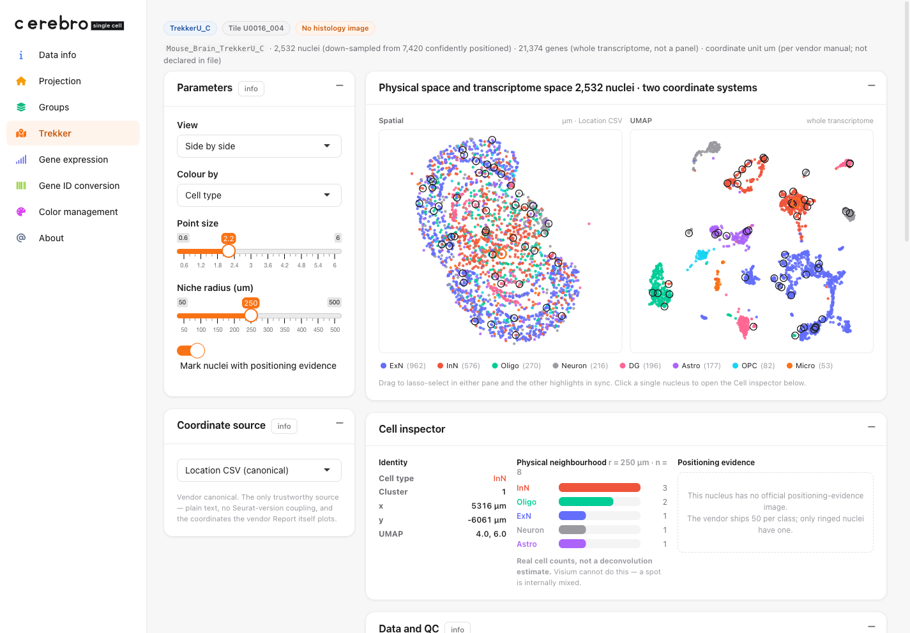
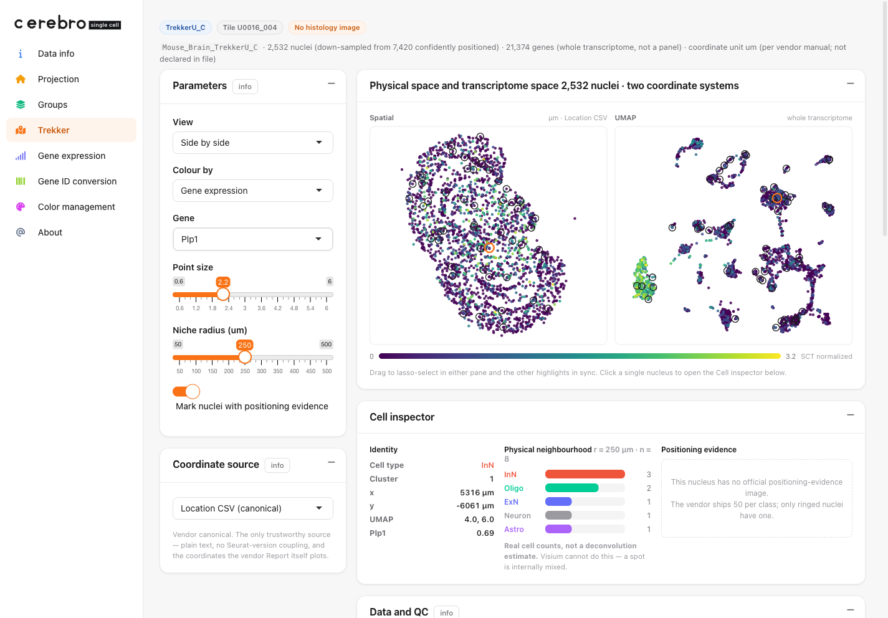
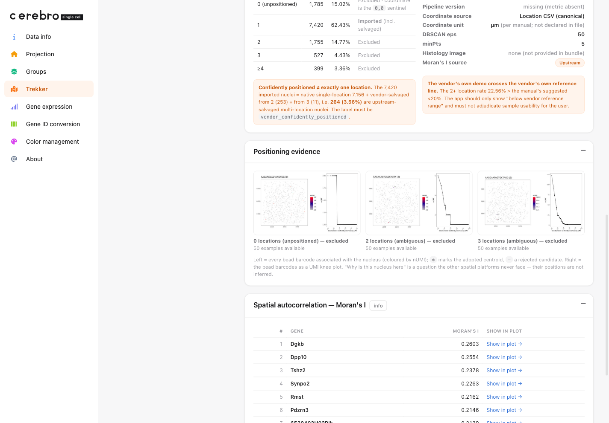

```{r, include = FALSE}
knitr::opts_chunk$set(collapse = TRUE, comment = "#>")
```

# What this guide does

This is an end-to-end, reproducible walk-through of the **Trekker** page: what
the data is, where it comes from, what is inside the download, and exactly how
the shipped demo `.crb` is built from it. Every code block is the real build
recipe (it lives in `data-raw/build_trekker_demo.R`); it is shown with
`eval = FALSE` because the raw input is a multi-gigabyte, access-gated vendor
bundle, not something a vignette can fetch.

Unlike the synthetic HLA fixture, **the Trekker demo is real measured data** —
down-sampled, but not invented. So this guide is also, unavoidably, a guide to
reading it honestly: where the coordinates really live, what "confidently
positioned" does and does not mean, and which numbers are the vendor's rather
than Cerebro's.

# What Trekker is

Trekker (Curio Bioscience / Takara Bio, the *Trekker Single-Cell Spatial Mapping
Kit*) tags cell **nuclei** with location barcodes carried by beads at known
positions, then recovers each nucleus's 2-D position from ordinary
single-nucleus sequencing. It is built on Slide-tags foundational technology.

Three ideas shape the page:

1. **Real single cells × whole transcriptome.** This is the cell Trekker
   occupies that the other platforms cannot: Visium measures the whole
   transcriptome but per 55 µm spot (not single cells); Xenium/MERFISH are
   single-cell but only over a gene panel; Trekker gives genuine single nuclei
   *and* all ~21k genes. Because every nucleus therefore has **both** a UMAP
   position and a physical position, the page shows the two side by side and lets
   you morph between them.

2. **Positions are inferred, and the evidence is auditable.** A Visium spot is
   simply *there*; a Trekker nucleus's location is estimated from its bead
   barcodes. The vendor ships a positioning-evidence image for a sample of nuclei
   (the bead-barcode cloud plus a UMI knee plot), so "why is this nucleus here?"
   is a question you can actually answer. The page surfaces those images.

3. **There is usually no matched histology image.** Positions come from bead
   barcodes, not a tissue photo, so — unlike the Visium/Xenium/MERFISH demos —
   the Trekker `.crb` carries no histology raster. That is correct, not an
   omission.

cerebroAppLite only **ingests and displays** the vendor pipeline's output; it
never runs the vendor Primary Analysis Pipeline (that is an HPC/cloud job far
larger than a Shiny session).

# Getting the data (registration required)

The Trekker example bundles are **not public downloads**. Access is gated:

1. Register for / sign in to a **Curio Bioscience / Takara Bio** account and
   request access to the Trekker example data.
2. Download a per-sample bundle. This demo uses the **smallest** of the example
   bundles, `Mouse_Brain_TrekkerU_C_Sept2025.tar.gz` (~1.3 GB compressed).
3. Extract it and note the `output/` directory:

```{r, eval = FALSE}
# in a shell
tar -xzf Mouse_Brain_TrekkerU_C_Sept2025.tar.gz
export TREKKER_OUTPUT_DIR=/path/to/Mouse_Brain_TrekkerU_C_Sept2025/output
```

Because the source is access-gated, the build script never phones home; it reads
only from `$TREKKER_OUTPUT_DIR`. The raw bundle is git-ignored and **not
redistributable**; only the derived, down-sampled `.crb` ships with the package.

# What is inside the bundle

The single-reaction bundle's `output/` folder holds the analysis object plus a
set of companion tables and QC images. The build reads exactly five of them:

| File | What the build takes from it |
| --- | --- |
| `<S>_ConfPositioned_seurat_spatial.rds` | whole-transcriptome expression, UMAP, Louvain clusters |
| `<S>_Location_ConfPositionedNuclei.csv` | the **canonical** (x, y) coordinates, in µm |
| `<S>_summary_metrics.csv` | positioning QC (kept under the vendor's own field names) |
| `<S>_variable_features_spatial_moransi.txt` | the **upstream** (vendor) Moran's I table |
| `cell_bc_plots/cells_{0,1,2,3}_*/` | positioning-evidence JPEGs (50 per class) |

`<S>` is the sample id, `Mouse_Brain_TrekkerU_C`. The directory names
`cells_0/1/2/3_coordinates_assigned` themselves record that positioning is a
four-way (0 / 1 / 2 / 3+ locations) classification, not a binary one.

# The three coordinate orientations (a real gotcha)

The same nucleus appears in three places inside the object, in **three different
orientations**. This is measured, not assumed:

| Source | Value for one example nucleus | Relation to canonical |
| --- | --- | --- |
| **Location CSV** (`SPATIAL_1`, `SPATIAL_2`) | `(6647, -4916)` | **canonical** (the authority) |
| `SPATIAL` reduction | `(6647, +4916)` | **y-mirrored** |
| `@images$slice1` (`GetTissueCoordinates`) | `(-4916, 6647)` | **axes transposed** |

The generic spatial extractor reads `@images` — and would therefore **silently
draw the tissue transposed 90°**, with no error. So the build takes coordinates
from the **Location CSV only**, and the page's "Coordinate source" control lets
you switch between all three so the discrepancy is visible rather than hidden.

# Build the demo .crb

The rest of this section is `data-raw/build_trekker_demo.R`, narrated. It needs
`Seurat`, `Matrix`, the `magick` and `base64enc` packages (build-time only), and
the in-tree cerebroAppLite (for the new `trekker` slot on `Cerebro_v1.3`).

## Setup

```{r, eval = FALSE}
library(Seurat)
library(Matrix)
pkgload::load_all(".", quiet = TRUE)   # in-tree class with add/getTrekker()
set.seed(42)

SAMPLE <- "Mouse_Brain_TrekkerU_C"
BASE   <- Sys.getenv("TREKKER_OUTPUT_DIR")
f      <- function(suffix) file.path(BASE, paste0(SAMPLE, suffix))
N_CELLS <- 2500L                       # down-sampled nucleus count
```

## Step 1 — read the vendor outputs

The object carries a legacy `SlideSeq` `@images` entry that predates the `misc`
slot, so any `subset()` on it errors. We never use `@images` (coordinates come
from the CSV), so we drop it up front to make the object subsettable.

```{r, eval = FALSE}
so <- readRDS(f("_ConfPositioned_seurat_spatial.rds"))
DefaultAssay(so) <- "SCT"
so@images <- list()                    # coordinates come from the CSV, not here
bc_all <- colnames(so)

# canonical coordinates (µm) — the vendor Location CSV is the authority
loc <- read.csv(f("_Location_ConfPositionedNuclei.csv"))
names(loc)[1] <- "barcode"
loc <- loc[match(bc_all, loc$barcode), ]
cx  <- loc$SPATIAL_1
cy  <- loc$SPATIAL_2

um   <- Embeddings(so, "umap")
clab <- as.integer(as.character(so@meta.data$seurat_clusters))   # 0-based cluster id
```

## Step 2 — cell types

The object ships 18 unnamed Louvain clusters. They were labelled once by marker
z-score argmax over canonical mouse-brain markers, and hard-coded (indexed by
cluster id) so the build is deterministic. Clusters without a clear marker winner
are honestly left `Neuron`, not over-called.

```{r, eval = FALSE}
# Snap25/Slc17a7 -> ExN, Gad1/Gad2 -> InN, Plp1/Mbp -> Oligo, Aqp4/Gfap -> Astro,
# Cx3cr1/C1qa/Csf1r -> Micro, Pdgfra -> OPC, Prox1 -> DG
CELLTYPE_BY_CLUSTER <- c(
  "ExN", "InN", "Oligo", "ExN", "Astro", "InN", "DG", "ExN", "ExN",
  "Neuron", "OPC", "Micro", "Neuron", "DG", "ExN", "Neuron", "ExN", "Neuron"
)
```

## Step 3 — positioning QC and upstream Moran's I

QC is parsed straight from `summary_metrics.csv`, keeping the vendor's own field
names; a metric that is absent stays absent (never replaced by 0). The Moran's I
table is the vendor's — labelled "Upstream" on the page and never mixed with
Cerebro's own.

```{r, eval = FALSE}
sm <- read.csv(f("_summary_metrics.csv"))
mv <- setNames(as.character(sm$Value), sm$Metrics)
# qc <- list(sample_id = mv[["Sample_ID"]], tile_id = mv[["Tile_ID"]],
#            total_nuclei = ..., conf = ..., pct_2plus = ...,
#            o_1 = ..., salv_2 = ..., salv_3 = ..., n_0 = ..., ...)   # see the script

mi <- read.table(f("_variable_features_spatial_moransi.txt"),
                 header = TRUE, sep = "\t")
mi <- mi[order(-mi$MoransI_observed), ]                 # top spatially variable genes
```

## Step 4 — positioning-evidence images

`cells_1_coordinates_assigned/<BC16>.jpeg` is a confidently-positioned nucleus's
evidence image; the file stem is the 16-character nucleus barcode, so `<BC16>-1`
is the object barcode. Each image is down-scaled and base64-embedded so the whole
demo — expression *and* evidence — stays in the one self-contained `.crb`.

```{r, eval = FALSE}
ev_dir  <- file.path(BASE, "cell_bc_plots")
ev_file <- list.files(file.path(ev_dir, "cells_1_coordinates_assigned"),
                      pattern = "\\.jpe?g$", full.names = TRUE)
ev_bc   <- paste0(sub("\\.jpe?g$", "", basename(ev_file)), "-1")

encode_jpeg <- function(path, max_px = 620L, quality = 68L) {
  img <- magick::image_read(path)
  img <- magick::image_resize(img, paste0(max_px, "x", max_px, ">"))
  raw <- magick::image_write(img, format = "jpeg", quality = quality)
  paste0("data:image/jpeg;base64,", base64enc::base64encode(raw))
}
```

## Step 5 — sub-sample (whole genes, force-include evidence)

The object is 21,374 genes × 7,420 nuclei. Embedding whole-transcriptome
expression for all of them blows a sensible size budget (measured: ~3.8 MB at
2,500 nuclei, before images). "Whole transcriptome" is the point, so we keep
**all genes** and down-sample **nuclei** instead — stratified by cluster — and
**force-include the 50 nuclei that carry an evidence image**, so the drill-down
still works.

```{r, eval = FALSE}
strat <- integer(0)
for (lv in sort(unique(clab))) {
  w <- which(clab == lv)
  k <- max(1L, round(N_CELLS * length(w) / length(clab)))
  strat <- c(strat, sample(w, min(k, length(w))))
}
idx    <- sort(unique(c(strat, match(ev_bc, bc_all))))   # + the evidence nuclei
sub_bc <- bc_all[idx]
```

## Step 6 — export a Cerebro object and attach the `trekker` slot

We build an ordinary `Cerebro_v1.3` object with `exportFromSeurat()` (whole-
transcriptome expression + UMAP + `cluster`/`celltype` groups) — this is what
powers gene colouring on the page. Then we attach a `trekker` slot with
everything else the bespoke page needs.

```{r, eval = FALSE}
sub <- subset(so, cells = sub_bc)
sub$celltype <- CELLTYPE_BY_CLUSTER[as.integer(as.character(sub$seurat_clusters)) + 1L]
sub$cluster  <- factor(as.integer(as.character(sub$seurat_clusters)))
sub$nUMI <- sub$nCount_SCT; sub$nGene <- sub$nFeature_SCT
sub <- DietSeurat(sub, assays = "SCT", dimreducs = "umap")   # drop dense scale.data

exportFromSeurat(
  sub, assay = "SCT", slot = "data",
  file = "inst/extdata/v1.4/demo_trekker.crb",
  experiment_name = "Trekker mouse brain (TrekkerU_C, demo)",
  organism = "mm",
  groups = c("cluster", "celltype"), main_group = "celltype",
  nUMI = "nUMI", nGene = "nGene"
)
```

The `trekker` slot holds the page's content. Every vector is `unname()`d — a
*named* R vector serialises to a JSON object (barcode → value), but the client
indexes these positionally as arrays. The `barcodes` field lets the server pull a
gene's expression aligned to these exact points, regardless of the expression
matrix's internal column order.

```{r, eval = FALSE}
trekker <- list(
  meta       = list(n_cells = length(idx), n_cells_full = length(bc_all),
                    n_genes_obj = nrow(so), unit = "um (per manual; not declared)"),
  qc         = qc,                                  # vendor field names (Step 3)
  barcodes   = unname(sub_bc),                      # SAME order as the arrays below
  x = unname(round(cx[idx], 2)), y = unname(round(cy[idx], 2)),   # canonical µm
  ux = unname(round(um[idx, 1], 3)), uy = unname(round(um[idx, 2], 3)),  # UMAP
  clusters   = unname(clab[idx]),
  celltype   = CELLTYPE_BY_CLUSTER,                 # cluster id -> label
  moran      = moran,                               # upstream vendor Moran's I
  evidence   = evidence,                            # {cell, bc, img=base64}
  qc_examples = qc_examples                         # one image per excluded class
)

crb <- readRDS("inst/extdata/v1.4/demo_trekker.crb")
crb$addTrekker(trekker)
saveRDS(crb, "inst/extdata/v1.4/demo_trekker.crb", compress = "xz")
```

The whole build is one command:

```{r, eval = FALSE}
# TREKKER_OUTPUT_DIR=/path/.../output Rscript data-raw/build_trekker_demo.R
# -> inst/extdata/v1.4/demo_trekker.crb  (~4.7 MB, 2,532 nuclei x 21,374 genes,
#                                         50 embedded evidence images)
```

# Load it in the app

The bundled app already lists the demo, so it is one dropdown click:

```{r, eval = FALSE}
shiny::runApp(system.file("app.R", package = "cerebroAppLite"))
# choose "Mouse brain (Trekker)" in the "Select dataset:" switcher
```

To host your own Trekker `.crb`, pass it to `createShinyApp()`. The **Trekker**
tab appears automatically whenever the loaded `.crb` carries a `trekker` slot.

# What the page shows

**Physical space and transcriptome space, side by side.** Every nucleus has both
a spatial and a UMAP position, so the two panes are linked: lasso-select in one
and the other highlights in sync. Colour by cell type, cluster, or any gene.



**Whole-transcriptome gene colouring.** Pick (or type) any of the ~21k measured
genes. Here *Plp1* — an oligodendrocyte marker — lights up the Oligo cluster in
the UMAP and its scattered cells in tissue, a quick sanity check that the two
coordinate systems refer to the same nuclei.



**Data and QC — in the vendor's own words.** Positioning class distribution,
the salvage caveat, provenance (including a *missing* pipeline version, kept
missing), the positioning-evidence gallery, and the upstream Moran's I table.



# Honest scope

- **`ConfPositioned` ≠ "exactly one location".** A fraction of the confidently-
  positioned set are vendor-salvaged multi-location nuclei (264 / 7,420 ≈ 3.56%
  here), and the object's `number_clusters` is all `1` — the salvage trace is
  erased. The page labels the set `vendor_confidently_positioned`, not "one
  location".
- **Unpositioned nuclei are `(0, 0)` sentinels**, not `NA`; they are class 0 and
  excluded, never plotted at the origin.
- **The vendor's own demo exceeds the vendor's own guideline**: the 2+-location
  rate (22.56%) is above the manual's `<20%`. The page shows "below vendor
  reference range" and does **not** adjudicate sample usability for you.
- **Moran's I is the upstream value**, computed differently from Cerebro's own
  (Euclidean 6-NN); the two are labelled separately and are not interchangeable.
- The demo is a **down-sampled subset** of one reaction, shown so the page works
  out of the box — not a biological result to read off.

See `data-raw/trekker.md` for the full design notes and `data-raw/DATASETS.md`
for the one-line provenance entry.

```{r}
sessionInfo()
```
